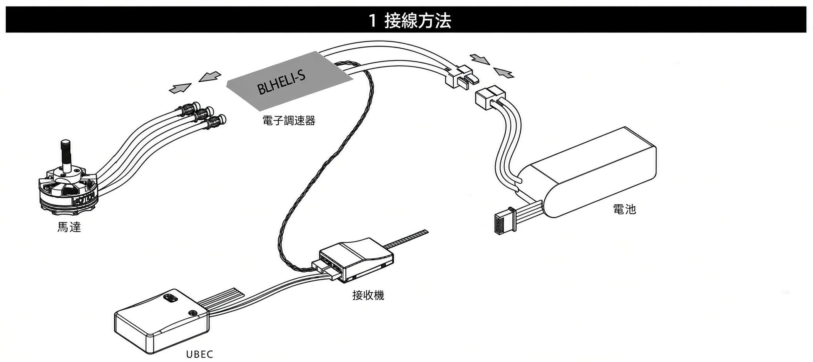
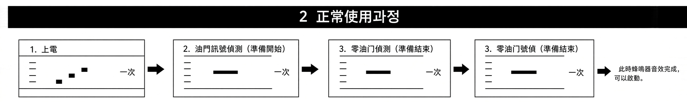
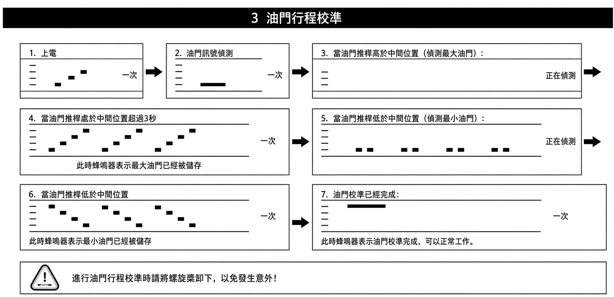

# 貨架 A0-4-1
盤點時間：2026/09/11-13:57

下次盤點時間：2026/09/18

## XXD_ESC_HW_30A_BEC

零件編號：1-2YWNF-XXD-HW-30-BEC

| 項目 | 規格 |
| --- | --- |
| 可支援電壓 | 2S-3S |
| 持續輸出電流 | 30A |
| 瞬時輸出電流 | 40A(10s) |
| BEC輸出電流 | 5V3A |
| 尺寸 | 50mm 25mm 7mm |
| 重量 | 29g |
---

## XXD_ESC_HW_40A_BEC

零件編號：1-2YWNF-XXD-HW-40-BEC

| 項目 | 規格 |
| --- | --- |
| 可支援電壓 | 2S-3S |
| 持續輸出電流 | 40A |
| 瞬時輸出電流 | 55A(10s) |
| BEC輸出電流 | 5V3A |
| 尺寸 | 70mm 26mm 7mm |
| 重量 | 36g |
---

## XXD_ESC_HW_50A_BEC

零件編號：1-2YWNF-XXD-HW-50-BEC

| 項目 | 規格 |
| --- | --- |
| 可支援電壓 | 2S-6S |
| 持續輸出電流 | 50A |
| 瞬時輸出電流 | 60A(10s) |
| BEC輸出電流 | 5V3A |
| 尺寸 | 65mm 36mm 15mm |
| 重量 | 44g |
---

## XXD_ESC_HW_60A_BEC

零件編號：1-2YWNF-XXD-HW-60-BEC

| 項目 | 規格 |
| --- | --- |
| 可支援電壓 | 2S-6S |
| 持續輸出電流 | 60A |
| 瞬時輸出電流 | 75A(10s) |
| BEC輸出電流 | 5V3A |
| 尺寸 | 62mm 36mm 15mm |
| 重量 | 49g |
---

## XXD_ESC_HW_80A_BEC

零件編號：1-2YWNF-XXD-HW-80-BEC

| 項目 | 規格 |
| --- | --- |
| 可支援電壓 | 2S-6S |
| 持續輸出電流 | 80A |
| 瞬時輸出電流 | 95A(10s) |
| BEC輸出電流 | 5V3A |
| 尺寸 | 85mm 39mm 14mm |
| 重量 | 76g |
---

## XXD_ESC_HW_125A_BEC

零件編號：1-2YWNF-XXD-HW-125-BEC

| 項目 | 規格 |
| --- | --- |
| 可支援電壓 | 2S-6S |
| 持續輸出電流 | 125A |
| 瞬時輸出電流 | 140A(10s) |
| BEC輸出電流 | 5V3A |
| 尺寸 | 82mm 39mm 17mm |
| 重量 | 99g |
---

## XXD_ESC_HW_200A_BEC

零件編號：1-2YWNF-XXD-HW-200-BEC

| 項目 | 規格 |
| --- | --- |
| 可支援電壓 | 2S-6S |
| 持續輸出電流 | 200A |
| 瞬時輸出電流 | 215A(10s) |
| BEC輸出電流 | 5V3A |
| 尺寸 | 80mm 40mm 24mm |
| 重量 | 113g |
---

## HW系列 產品特性
● 使用 EMF8BB2 晶片， 48MHz 運轉頻率性能強大  
● 主要針對 固定翼、滑翔機、直升機  
● 油門反應速度較慢（平滑漸進）為了保護飛機齒輪或漿葉，油門加大時轉速會線性柔和地升起  
● 低電壓保護 (LVC)有，電池快沒電時會降功率或斷電保護電池，但多軸無人機遇到此狀況會直接翻車摔機  
● 設定與校準支援用遙控器搖桿聽嗶嗶聲進行複雜設定（如煞車、電池類型等）  
● 使用 BLHeli-S 開源程序，可透過油門訊號線升級韌體或變更電調參數，支援 BLHeli-S 全部功能  
● 尺寸更小，重量更輕，方便安裝  
● 類似與 Freewheeling 的 Damped light 模式帶來更快的馬達對應  
● 電調可支援普通 PWM 油門模式， OneShot125 油門模式， OneShot42 油門模式以及 MultiShot 油門模式  
● 電調可支援最新 DShot150/300/600 油門模式  
● 油門訊號線為雙線，有效降低訊號在銅線內傳輸所產生的串擾，令飛行更穩定  
● 普通油門模式下最高可支援刷新率高達 621Hz 的油門訊號，相容於各種飛控  

## HW系列 保護功能
- 自動選擇2-3LIPO,分別保護電壓是6V/9V
- 自動選NIMH，每節保護電壓是0.8V
- 安全啟動，油門位置不對禁止啟動
- 溫度保護，110度表面溫度停機
- 失控保護，無訊號1秒以後停機
- 轉速上限
    - 2極內轉高達300000轉
    - 12極外轉50000轉
    - 14極外轉42000轉

## HW系列 設定方法
紅色正極 黑色負極 黃色訊號線  
1.打開發射機，把油門推到（FUTABA系列發射機需要把油門通道選擇REV使用）  
2、連​​接好接收機與馬達  
3.接通電調電源,發射機正常的話,就是有以下聲音：  \

B_B_：表示LIPO自動保護  
BB_BB_：表示NIMH /NICD自動保護  
BBB_BBB_：表示煞車選擇  

開機是B的一聲長音，表示電調在LIPO自動保護狀態，BBB三聲，表示NIMH /NICD自動保護狀態  
(如果這個聲音結束以後是一聲長 的「嘀」的聲音以後不再有聲音，那麼檢查發射機油門通道反向設定。)  
---

## XXD_ESC_SK_10A_BEC

零件編號：1-2YWNF-XXD-SK-10-BEC

| 項目 | 規格 |
| --- | --- |
| 可支援電壓 | 2S - 3S 鋰電池 |
| 持續輸出電流 | 10A |
| 瞬時輸出電流 | 13A ~ 15A (10s) |
| BEC輸出電流 | 5V / 1A 或 2A |
| 尺寸 | 23.5mm × 15mm × 6.1mm |
| 重量 | 10g ~ 12g |
---

## XXD_ESC_SK_12A_BEC

零件編號：1-2YWNF-XXD-SK-12-BEC

| 項目 | 規格 |
| --- | --- |
| 可支援電壓 | 2S - 3S 鋰電池 |
| 持續輸出電流 | 10A |
| 瞬時輸出電流 | 13A ~ 15A (10s) |
| BEC輸出電流 | 5V / 1A 或 2A |
| 尺寸 | 23.5mm × 15mm × 6.1mm |
| 重量 | 10g ~ 12g |
---

## XXD_ESC_SK_20A_BEC

零件編號：1-2YWNF-XXD-SK-20-BEC

| 項目 | 規格 |
| --- | --- |
| 可支援電壓 | 2S - 3S 鋰電池 |
| 持續輸出電流 | 20A |
| 瞬時輸出電流 | 25A (10s) |
| BEC輸出電流 | 5V / 2A |
| 尺寸 | 45mm × 24mm × 11mm |
| 重量 | 25g |
---

## XXD_ESC_SK_30A_BEC

零件編號：1-2YWNF-XXD-SK-30-BEC

| 項目 | 規格 |
| --- | --- |
| 可支援電壓 | 2S - 3S (部分進階版支援 2S - 4S) |
| 持續輸出電流 | 30A |
| 瞬時輸出電流 | 35A ~ 40A (10s) |
| BEC輸出電流 | 5V / 2A 或 3A |
| 尺寸 | 50mm × 23mm × 8mm |
| 重量 | 25g |
---

## XXD_ESC_SK_40A_BEC

零件編號：1-2YWNF-XXD-SK-40-BEC

| 項目 | 規格 |
| --- | --- |
| 可支援電壓 | 2S - 4S 鋰電池 |
| 持續輸出電流 | 40A |
| 瞬時輸出電流 | 50A ~ 55A (10s) |
| BEC輸出電流 | 5V / 3A |
| 尺寸 | 55mm × 27mm × 8mm |
| 重量 | 36g |
---

## XXD_ESC_SK_50A

零件編號：1-2YWNF-XXD-SK-50

| 項目 | 規格 |
| --- | --- |
| 可支援電壓 | 2S - 6S 鋰電池 |
| 持續輸出電流 | 50A |
| 瞬時輸出電流 | 65A (10s) |
| BEC輸出電流 | OPTO (無內建 BEC，需外接 UBEC 給飛控供電) |
| 尺寸 | 68mm × 25mm × 8mm |
| 重量 | 48g |
---

## XXD_ESC_SK_80A

零件編號：1-2YWNF-XXD-SK-80

| 項目 | 規格 |
| --- | --- |
| 可支援電壓 | 2S - 6S 鋰電池 |
| 持續輸出電流 | 80A |
| 瞬時輸出電流 | 90A ~ 100A (10s) |
| BEC輸出電流 | OPTO (無內建 BEC，需外接 UBEC 給飛控供電) |
| 尺寸 | 86mm × 38mm × 12mm |
| 重量 | 85g |
---

## SK系列 產品特性
● 使用 EMF8BB2 晶片， 48MHz 運轉頻率性能強大  
● 主要針對 多旋翼無人機（四軸/六軸等）  
● 油門反應速度極快（即時響應）無緩衝直接輸出，更新率可達 490Hz 以上，滿足多軸飛行器瞬間平衡調整的需求  
● 低電壓保護 (LVC)無，為了避免無人機空中斷電墜毀，即使壓榨損壞電池也要保證馬達不停轉  
● 設定與校準幾乎不需設定，通常出廠就針對多軸優化，通常只需要做一次油門行程校準  
● 使用 SimonK 開源程序，可透過油門訊號線升級韌體或變更電調參數，支援 SimonK 全部功能  
● 尺寸更小，重量更輕，方便安裝  
● 類似與 Freewheeling 的 Damped light 模式帶來更快的馬達對應  
● 電調可支援普通 PWM 油門模式， OneShot125 油門模式， OneShot42 油門模式以及 MultiShot 油門模式  
● 電調可支援最新 DShot150/300/600 油門模式  
● 油門訊號線為雙線，有效降低訊號在銅線內傳輸所產生的串擾，令飛行更穩定  
● 普通油門模式下最高可支援刷新率高達 621Hz 的油門訊號，相容於各種飛控  

## SK系列 保護功能
- 自動選擇2-3LIPO,分別保護電壓是6V/9V
- 自動選NIMH，每節保護電壓是0.8V
- 安全啟動，油門位置不對禁止啟動
- 溫度保護，110度表面溫度停機
- 失控保護，無訊號1秒以後停機
- 轉速上限
    - 2極內轉高達300000轉
    - 12極外轉50000轉
    - 14極外轉42000轉

## SK系列 設定方法
紅色正極 黑色負極 黃色訊號線  
1.打開發射機，把油門推到（FUTABA系列發射機需要把油門通道選擇REV使用）  
2、連​​接好接收機與馬達  
3.接通電調電源,發射機正常的話,就是有以下聲音：  \

B_B_：表示LIPO自動保護  
BB_BB_：表示NIMH /NICD自動保護  
BBB_BBB_：表示煞車選擇  

開機是B的一聲長音，表示電調在LIPO自動保護狀態，BBB三聲，表示NIMH /NICD自動保護狀態  
(如果這個聲音結束以後是一聲長 的「嘀」的聲音以後不再有聲音，那麼檢查發射機油門通道反向設定。)  
---

---
