# 貨架 A0-5-1
盤點時間：2026/09/11-10:33

下次盤點時間：2026/09/18

## 8ARMS_RGT_E2U_F405

零件編號：1-ZD-FR-E2U-F405

| 項目 | 規格 |
| --- | --- |
| MCU | STM32F405RGT6（M4、168 MHz、1 MB Flash） |
| 陀螺儀 | ICM-42605（部分版可能為 BMI270） |
| 氣壓計 | SPL06 / SPL06-001 |
| OSD | **僅 HD OSD**（DJI HD、Snail HD、OpenIPC 等），**不支援類比 OSD** |
| UART | 約 3～3.5 組（SBUS 僅 RX，常計半組） |
| SBUS | 1（RX only） |
| PWM | 6 路 + 1（S12 常用作 LED） |
| I²C | 1（外接電流計／氣速等） |
| 電流計 | **無板載類比電流計**；支援外接 I²C 電流計 |
| 電壓量測 | 標稱 2.5–30 V（1–6S）；實際需注意板上僅雙 LDO |
| 飛控供電 | **5 V 輸入**（獨立 BEC） |
| USB | Type-C（可直插；雙 Type-C 線可連手機地面站） |
| 圖傳 | SH1.0 6P 直插 HD VTX |
| 接收機 | SBUS / CRSF；可直插 ELRS 接收機 |
| 尺寸 | 27.9 × 20.3 × 11.2 mm |
| 重量 | 2.8 g（不含排針）；焊排針約 5.3 g |
| PCB | 黑油、沉金、樹脂塞孔、四層板 |

> 注意：這不是一體式 AIO 飛控。板上沒有伺服馬達供電軌，伺服馬達必須用外接 BEC。體積雖小，完整系統仍需獨立電源模組。

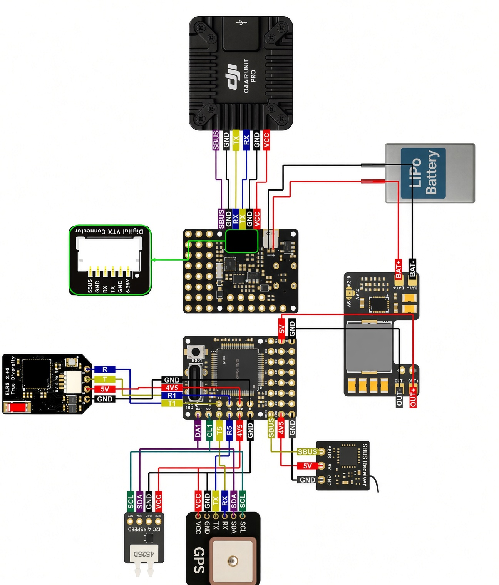
---

## 8ARMS_RGT_2VU_F405

零件編號：1-ZD-FR-2VU-F405

| 項目 | 規格 |
| --- | --- |
| 尺寸 | 36.6 × 36.6 × 8.0 mm；剪斷安裝耳後 28.1 × 31.1 × 8.0 mm |
| 孔距 | 30.5 mm／20 mm（內孔 Φ4 mm） |
| 質量 | 6.3 g |
| 主控 | STM32F405RGT6，168 MHz，Flash 1 MB，RAM 192 KB |
| IMU | Invensense 第三代 ICM-42688-P |
| 氣壓計 | Goertek SPA06／SPA06-003 |
| 磁力計 | 無板載 |
| 類比 OSD | AT7456E |
| BEC | MP9943 + MP9943：設備 **5V／3A**，圖傳 **9V／2A** |
| UART | 6 組（UART3 僅引出 RX） |
| PWM | 5 個（4 ESC + 1 LED） |
| I2C | 1 |
| 電流 ADC | 支援（板載電流計取樣） |
| SWD | 無 |
| 蜂鳴器 | 參數表標示無 |
| LED | 支援 WS2812 |
| USB | Type-C 板載直插 |
| 黑盒子 | 板載 NOR Flash 16 MB（128 Mbit） |
| SBUS | 參數表標示不支援（接收機多用 CRSF／ELRS UART） |
| VBAT | 7–28 V DC IN，2–6S LiPo |
| 工作溫度 | −10–100 °C |
| 儲存溫度 | 0–40 °C |

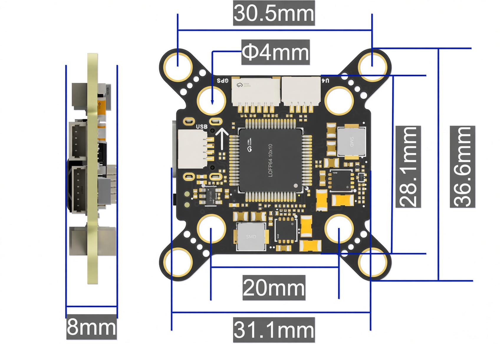
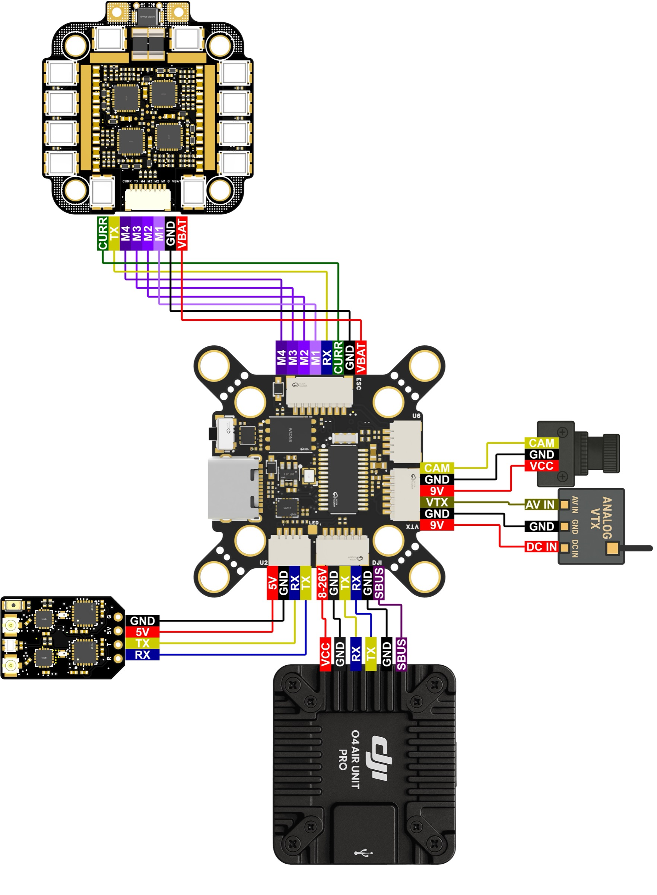
---

## 8ARMS_RGT_2VU_H743v2

零件編號：1-ZD-MA-2VU-H743V2

| 項目 | 規格 |
| --- | --- |
| 主控 MCU | STM32H743VIT6，480 MHz，2 MB Flash |
| IMU | BMI088 + BMI270 雙 IMU |
| 氣壓計 | SPL06 |
| 板載磁力計 | QMC5883L |
| 類比 OSD | AT7456E（目前 PX4 韌體暫不支援 OSD） |
| 日誌儲存 | microSD 卡槽 |
| UART | 8 路 |
| PWM | 11 路；PWM1–PWM8 支援 DShot 與雙向 DShot，實際能力取決於韌體 |
| I²C | 1 路 |
| SWD | 1 路 |
| ADC | 2 路：電池電壓與電流偵測 |
| USB | USB Type-C |
| 高清圖傳 | DJI O3/O4 相容介面，支援 DisplayPort |
| 接收機 | UART6 為預設 RC 輸入 |
| 其他 | 蜂鳴器、序列 LED、BOOT 按鍵／焊盤 |
| 電池輸入 | 2–6S，6–27 V |
| 5 V BEC | 最大 3 A，適用接收機、GPS、光流等週邊 |
| 12 V BEC | 最大 3 A，適用圖傳、攝影機等週邊 |
| 安裝孔距 | 30.5 × 30.5 mm |
| 安裝孔徑 | Φ4 mm |
| 外形尺寸 | 36 × 36 × 8 mm |
| 重量 | 10 g |

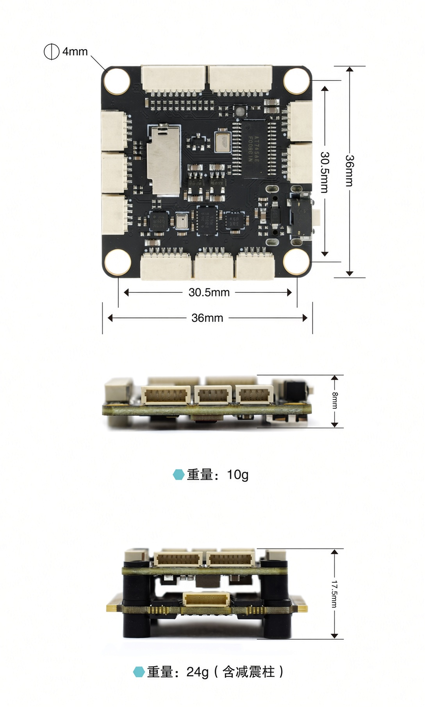
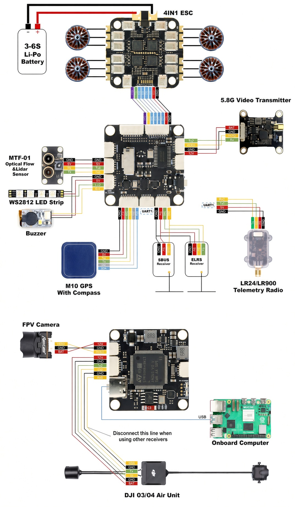
---

## 8ARMS_RGT_2VU_H743v1

零件編號：1-ZD-MA-2VU-H743V1

| 項目 | 規格 |
| --- | --- |
| 主控 MCU | STM32H743VIT6，480 MHz，2 MB Flash |
| IMU | BMI088 + BMI270 雙 IMU |
| 氣壓計 | DPS310 |
| 板載磁力計 | IST8310 |
| 類比 OSD | AT7456E（目前 PX4 暫不支援 OSD） |
| 日誌儲存 | microSD 卡槽 |
| UART | 7 路：UART1、2、3、4、6、7、8 |
| PWM | 10 路；PWM1–10 支援 DShot，PWM1–8 支援雙向 DShot（視韌體） |
| CAN | 1 路 |
| I²C | 1 路 |
| SWD | 1 路 |
| ADC | 2 路：電壓與電流 |
| USB | Type-C |
| 高清圖傳 | DJI O3/O4，預設 UART2 DisplayPort |
| 接收機 | UART6 預設 RC |
| 其他 | 蜂鳴器、狀態燈、BOOT |
| 電池輸入 | 2–6S，6–27 V |
| 5 V BEC | 最大 3 A（接收機、GPS、光流等） |
| 9 V BEC | 最大 3 A（圖傳、攝影機） |
| 安裝孔距 | 30.5 × 30.5 mm |
| 安裝孔徑 | Φ4 mm |
| 外形尺寸 | 36 × 36 × 8 mm |
| 重量 | 9–10 g（表格寫 9 g，尺寸圖標 10 g） |

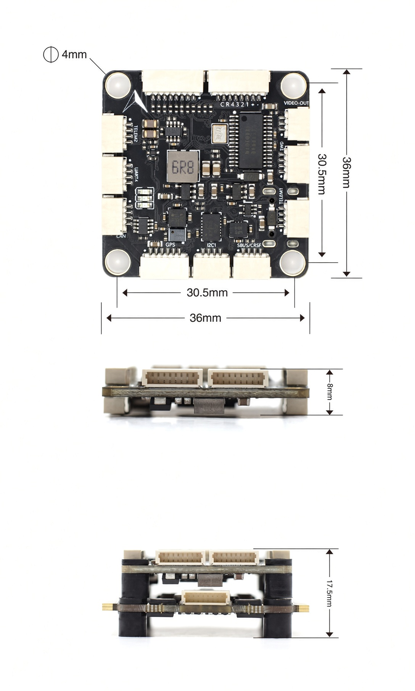
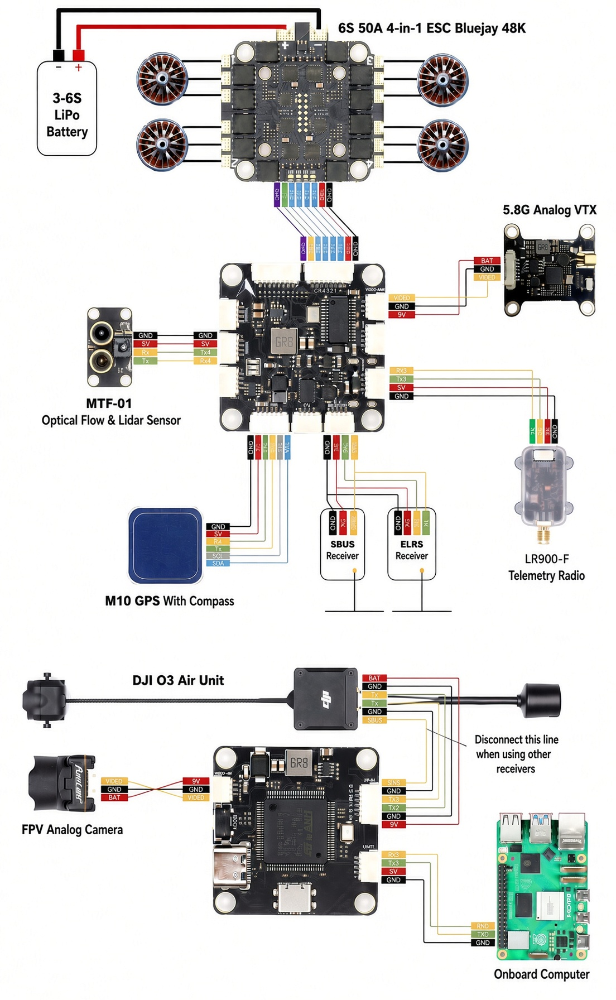
---

## 8ARMS_RGT_2VU_H743L

零件編號：1-ZD-MA-2VU-H743L

| 項目 | 規格 |
| --- | --- |
| MCU | STM32H743VIT6，480 MHz，2 MB Flash |
| IMU | ICM45686 |
| 氣壓計 | SPA06 |
| 磁力計 | 無（可 I²C 外接） |
| 類比 OSD | 無（用 DisplayPort） |
| UART | 8 |
| PWM |15（PWM15 與序列 LED 共用 |
| I²C | 1 |
| BEC | 5 V／2 A + 9 V／2 A |
| 輸入 | 2–6S，6–27 V |
| 孔距／尺寸／重量 | 30.5×30.5 mm Φ4／36×36×8 mm／10 g |
| 藍牙 | UART8，115200 |
| RC | UART6 |

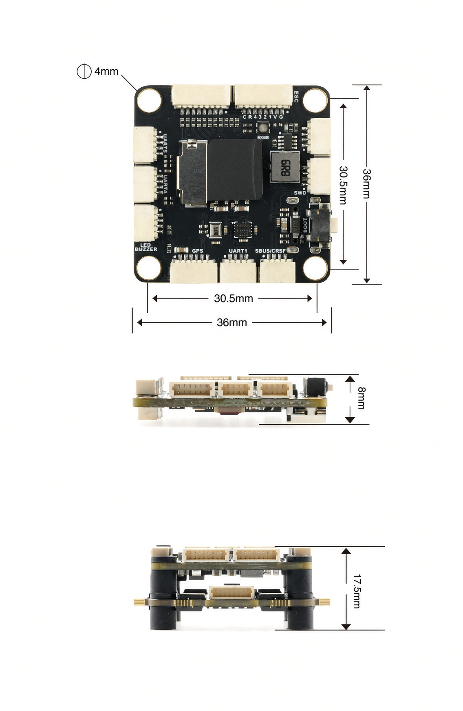
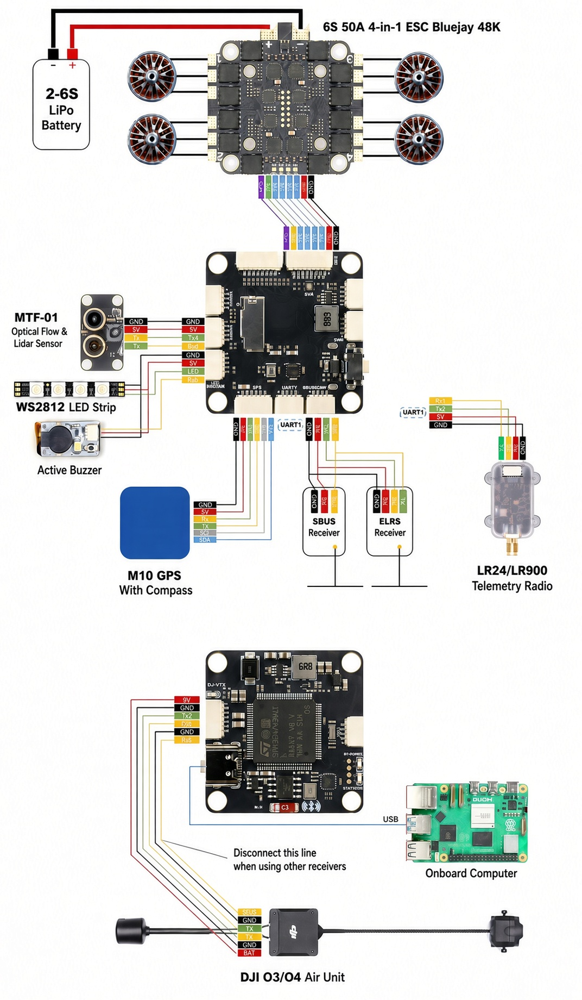
---

## 8ARMS_RGT_2VU_F405v2

零件編號：1-ZD-MA-2VU-F405V2

| 項目 | 規格 |
| --- | --- |
| MCU | STM32F405RGT6，168 MHz，1 MB Flash |
| IMU／氣壓 | BMI088／SPL06 |
| 磁力計 | 無（I²C 外接） |
| 類比 OSD | AT7456E |
| 日誌 | microSD |
| UART | 6 |
| PWM | 10 |
| I²C | 1 |
| SWD | 1 |
| ADC | 電壓＋電流 |
| BEC | 5 V／3 A、9 V／3 A |
| 孔距／尺寸／重量 | 30.5×30.5 mm Φ4／約 36×36×8 mm／約 9–9.5 g |

> 勿把 VBAT 接到 5V，也勿把 9V 接到只支援 5V 的接收機。

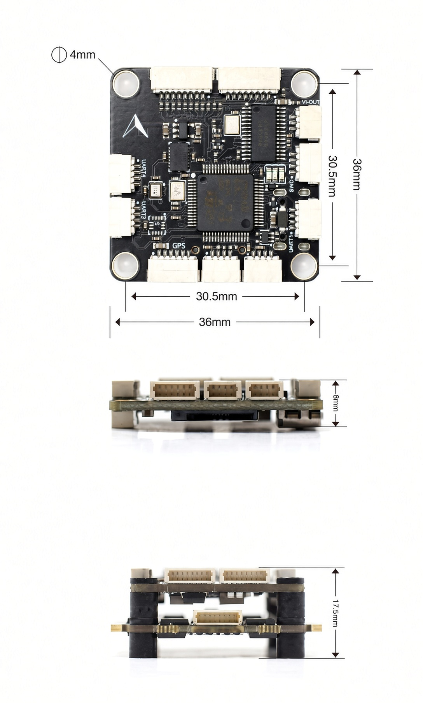
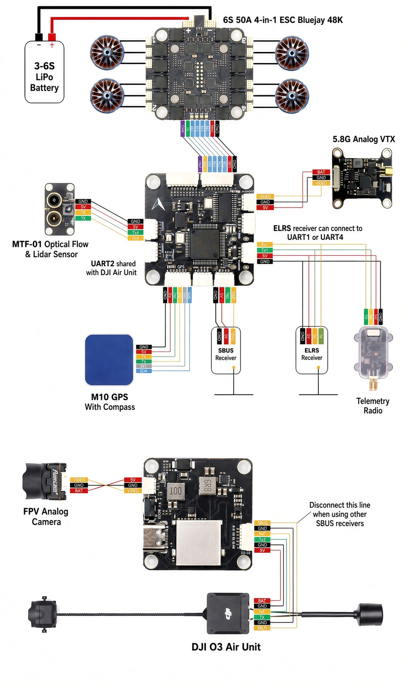
---
