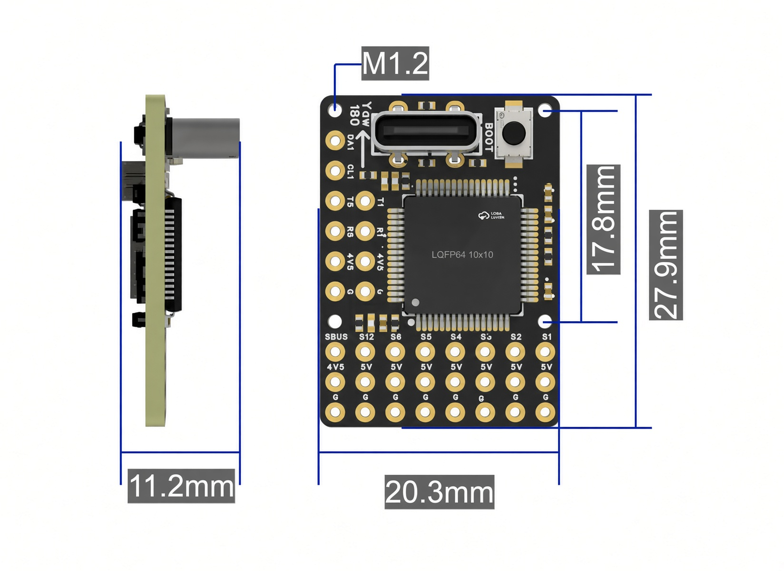
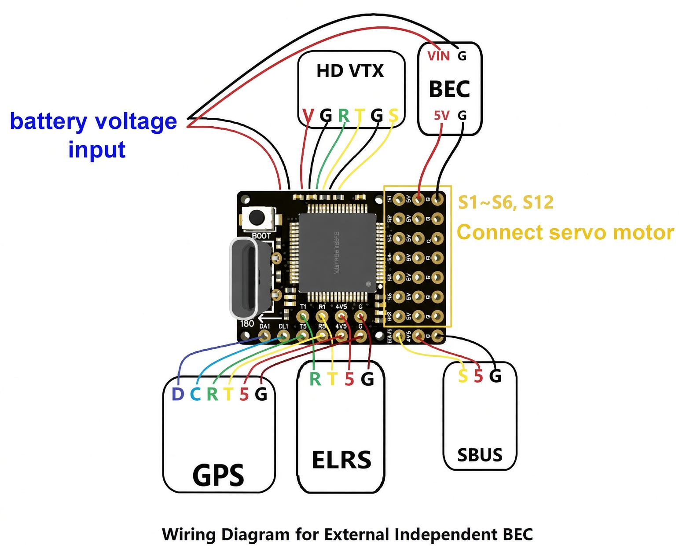

# 貨架 A0-5-1
盤點時間：2026/09/11-10:33

下次盤點時間：2026/09/18

## 8ARMS_RGT_F405

零件編號：1-ZD-FR-E2U-F405

| 項目 | 規格 |
| --- | --- |
| MCU | STM32F405RGT6（M4、168 MHz、1 MB Flash） |
| 陀螺儀 | ICM-42605（部分版可能為 BMI270） |
| 氣壓計 | SPL06 / SPL06-001 |
| OSD | **僅 HD OSD**（DJI HD、Snail HD、OpenIPC 等），**不支援類比 OSD** |
| UART | 約 3～3.5 組（SBUS 僅 RX，常計半組） |
| SBUS | 1（RX only） |
| PWM | 6 路 + 1（S12 常用作 LED） |
| I²C | 1（外接電流計／氣速等） |
| 電流計 | **無板載類比電流計**；支援外接 I²C 電流計 |
| 電壓量測 | 標稱 2.5–30 V（1–6S）；實際需注意板上僅雙 LDO |
| 飛控供電 | **5 V 輸入**（獨立 BEC） |
| USB | Type-C（可直插；雙 Type-C 線可連手機地面站） |
| 圖傳 | SH1.0 6P 直插 HD VTX |
| 接收機 | SBUS / CRSF；可直插 ELRS 接收機 |
| 尺寸 | 27.9 × 20.3 × 11.2 mm |
| 重量 | 2.8 g（不含排針）；焊排針約 5.3 g |
| PCB | 黑油、沉金、樹脂塞孔、四層板 |

### 101010
11111111111111111111111
111111111111111111111111111111111111111111111111111
1111111111111111111111111111111111111

#### aaa
bbbbbbbbbbbbbbbbbbbbbb
ccccccccccccccccccccccccccccccccc

##### ddd
a;sldfjas;ldfjas;dlfjas;lfkjasd;lkf
as;dflkjasd;lfkjasd;f
as;dflkjasd;lfads;fljasdf;lkasjf;lasdjf;kdl
as;dflkjasd;flkjsad;f
a;sdflkjas;dflkjas;dfjkas;ldfj
a;sdflkjas;dflkj
a;sldfja;sdlfjas;dfjkas;dlfkjas;
;asldfa;sldkj;lasdkf;asfj
